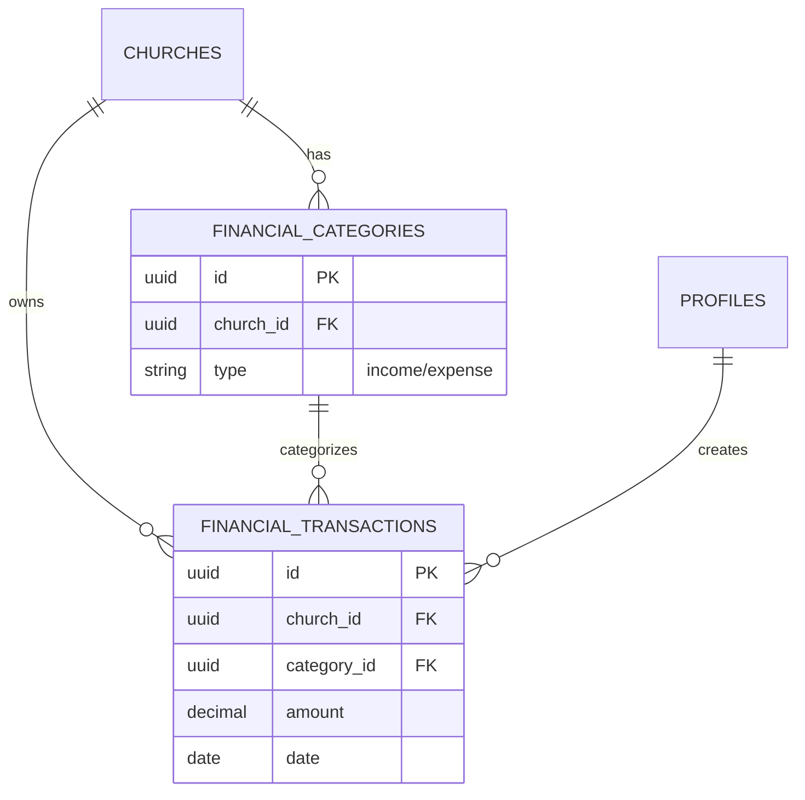

# Sprint 3: Finances, Events & Access Control

**Goal**: Bring the "engine" of the system to life by implementing full-stack Finance and Events modules, replacing mocks with real Supabase integrations, and enforcing multi-church tenancy.

## 1. Modules & Impact
-   **Finance (`/admin/finance`)**:
    -   Transaction management (Inflow/Outflow).
    -   Categories (Tithes, Offerings, Expenses).
    -   Dashboard summaries (Balance, Monthly logic).
-   **Events / Agenda (`/admin/agenda`)**:
    -   Calendar management.
    -   Event CRUD (Services, Meetings).
    -   Volunteers/Scales (Basic association).
-   **Dashboard (`/admin`)**:
    -   Connect real Finance/Event data to KPIs.
-   **Access Control**:
    -   Permissions: `finance_view`, `finance_edit`, `events_view`, `events_edit`.

## 2. Logical Data Model (Supabase)

### Finance
-   **`financial_categories`**:
    -   `id` (uuid, PK)
    -   `church_id` (uuid, FK to churches)
    -   `type` (text: 'income' / 'expense')
    -   `name` (text)
    -   `description` (text, nullable)
    -   `is_active` (boolean, default true)
    -   `created_at`, `created_by`
-   **`financial_transactions`**:
    -   `id` (uuid, PK)
    -   `church_id` (uuid, FK to churches)
    -   `category_id` (uuid, FK to financial_categories)
    -   `type` (text: 'income' / 'expense')
    -   `amount` (numeric, always positive)
    -   `date` (date)
    -   `description` (text)
    -   `payment_method` (text: 'money', 'pix', 'card', 'transfer')
    -   `reference` (text, nullable - e.g. campaign ID)
    -   `created_at`, `created_by`, `updated_at`

### Entity Relationship Diagram

### Dashboard Integration Logic
-   **Weekly Offerings (KPI)**:
    -   Query: `Sum(amount)` from `financial_transactions`
    -   Where: `church_id = current_church` AND `type = 'income'` AND `date` between `StartOfWeek` and `EndOfWeek`.
-   **Monthly Balance**:
    -   Income: `Sum(amount)` where `type = 'income'` AND `Month(date) = CurrentMonth`.
    -   Expense: `Sum(amount)` where `type = 'expense'` AND `Month(date) = CurrentMonth`.
    -   Balance: `Income - Expense`.

### RLS Strategy
-   **Security**: Strict isolation by `church_id`.
-   **Access**:
    -   **SELECT**: `SuperAdmin` OR (`auth.uid() -> profile.church_id` match) AND (`access_profile.permissions -> finance` is true).
    -   **WRITE**: Same as above, ensuring only authorized personnel edit finances.

### Events / Agenda
### Events / Agenda
-   **`church_events`**:
    -   `id` (uuid, PK)
    -   `church_id` (uuid, FK to churches)
    -   `title` (text)
    -   `event_type` (text: 'culto', 'reuniao', 'visita', 'vigilia', 'ensaio')
    -   `description` (text, optional)
    -   `location` (text, optional)
    -   `start_time` (timestamptz)
    -   `end_time` (timestamptz, optional)
    -   `is_public` (boolean, default true)
    -   `created_at`, `created_by`

### Dashboard - Events Logic
-   **Next Events**: Count of `church_events` where `start_time >= now()`
-   **Visits (Visitas)**: Count of `church_events` where `event_type = 'visita'` AND `date` in CurrentWeek.

## 3. Key Use Cases

### Tesouraria (Treasury)
-   **Login**: Access Finance module.
-   **Input**: Launch Weekly Tithes & Offerings (Batch or Single).
-   **Expense**: Register utility bills, maintenance costs.
-   **Report**: See "Current Month Balance" and "Cash Flow".

### Secretaria / Pastoral
-   **Agenda**: Create the "Sunday Service" recurring event (or single instances for now).
-   **View**: See list of upcoming events on Dashboard.

### Leadership (Pastor)
-   **View**: Read-only view of Finance (Graph) and Agenda.

## 4. Technical Tasks

### Database & RLS
-   [ ] Create `financial_transactions` table with RLS (tenant isolation).
-   [ ] Create `events` table with RLS.
-   [ ] Create indexes for performance (date, church_id).

### API / Hooks (`src/hooks`)
-   [ ] `useFinance`: `transactions`, `addTransaction`, `deleteTransaction`, `metrics`.
-   [ ] `useEvents`: `events`, `addEvent`, `updateEvent`, `deleteEvent`.

### UI Implementation
-   [ ] **Finance Page**:
    -   Replace static table with `useFinance` data.
    -   Add "New Transaction" Modal/Sheet.
    -   Implement "Month/Year" filter.
-   [ ] **Agenda Page**:
    -   Replace static calendar with `useEvents` data.
    -   Add "New Event" Modal.
    -   List view vs Calendar view (using fullcontent calendar or simple list first).
-   [ ] **Dashboard Update**:
    -   Fetch real "Weekly Offerings" sum.
    -   Fetch real "Next Events" count.

### Access Control
-   [ ] Ensure `Sidebar` hides Finance link if `!permissions.finance`.
-   [ ] Ensure RLS blocks unauthorized queries.
